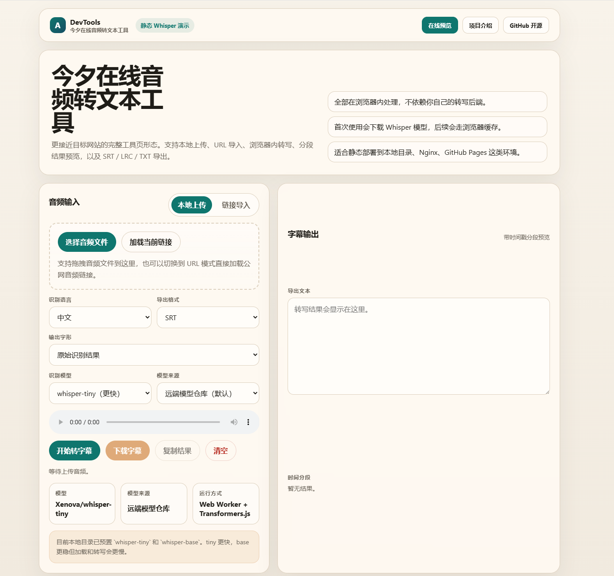
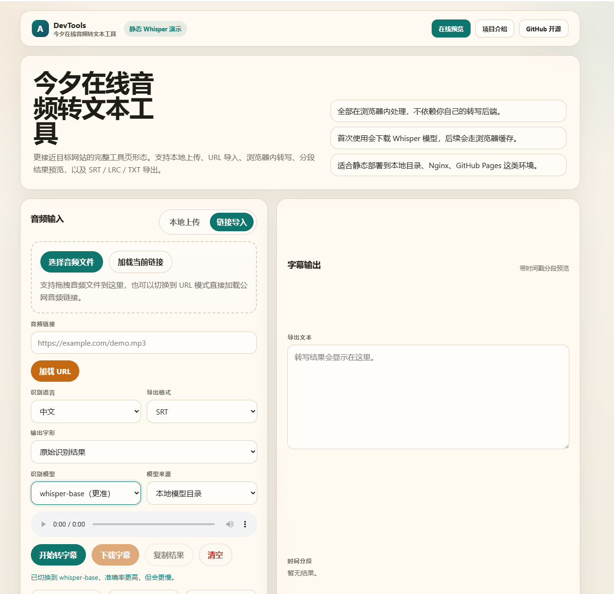
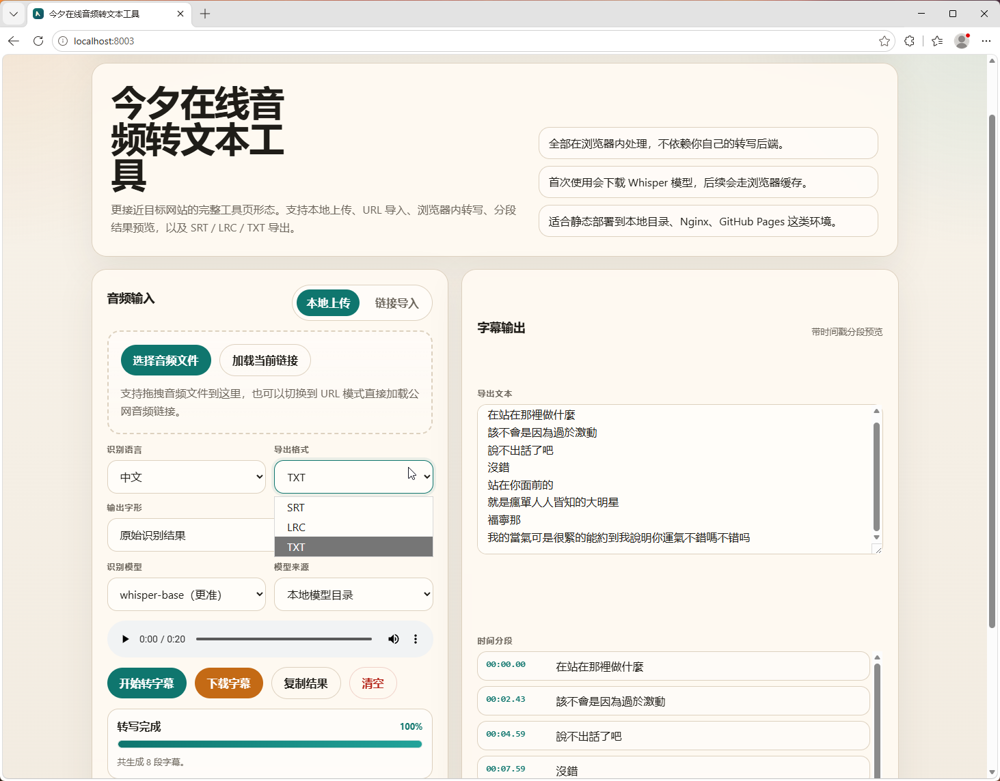

# 今夕在线音频转文本工具

一个浏览器端音频转文字、音频转字幕的静态网页工具。它使用 Transformers.js 在浏览器中运行 Whisper 模型，支持上传音频、试听、转写、分段预览，并导出 SRT、LRC、TXT。

[](LICENSE)


## 快速入口

- 在线预览：https://www.jxshn.com/tools/gongju/audio-subtitle/transcribe.php
- 项目介绍：https://www.jxshn.com/2429.html
- GitHub 仓库：https://github.com/xielaoban-pro/jinxi-audio-to-text

## 网盘下载

- 百度网盘：https://pan.baidu.com/s/1h6E7rHoYIRH3h6COL6zhNw?pwd=eqwp
  - 提取码：`eqwp`
- 夸克网盘：https://pan.quark.cn/s/737027169871

## 项目特点

- 不需要自建转写后端，主要流程在访客浏览器中完成
- 支持本地音频上传后直接播放试听
- 支持 TXT、SRT、LRC 三种结果格式
- 内置 `Xenova/whisper-tiny` 和 `Xenova/whisper-base` 本地模型目录
- 适合静态部署、学习浏览器端 AI 工具实现、二次开发字幕工具

## 界面预览







## 功能

- 本地音频上传，上传后可直接播放试听
- 支持公网音频 URL 导入
- 浏览器内完成音频解码、重采样和 Whisper 推理
- 支持 SRT、LRC、TXT 三种结果格式
- 支持时间分段预览
- 支持简繁转换
- 支持远端模型仓库和本地模型目录两种模型来源

## 目录结构

```text
.
├── index.html          # 主页面
├── app.js              # 页面交互、音频处理、结果导出
├── worker.js           # Web Worker，负责模型加载和转写
├── server.js           # 本地静态服务
├── start-site.bat      # Windows 一键启动脚本
├── screenshots/        # README 预览图片
├── vendor/             # 前端依赖文件
└── models/             # 可选本地模型目录
```

## 本地运行

需要安装 Node.js。

```bash
node server.js 8000
```

然后打开：

```text
http://localhost:8000
```

Windows 下也可以双击：

```text
start-site.bat
```

## 模型说明

默认模型为 `Xenova/whisper-tiny`。当前本地目录已预置 `Xenova/whisper-tiny` 和 `Xenova/whisper-base`，可以在模型来源中选择“本地模型目录”直接使用。tiny 更快，base 更稳但加载和转写会更慢。

如果要继续增加其他本地模型，请把 Transformers.js 兼容格式的模型文件放到：

```text
models/Xenova/模型名称/
```

常见文件包括：

```text
config.json
generation_config.json
preprocessor_config.json
tokenizer.json
tokenizer_config.json
onnx/encoder_model_quantized.onnx
onnx/decoder_model_merged_quantized.onnx
```

## 部署

这个项目是静态前端工具，可以部署到任意静态 Web 服务，例如 Nginx、Apache、GitHub Pages 或 Cloudflare Pages。

注意事项：

- `.wasm` 文件需要用 `application/wasm` 类型返回
- 模型文件较大，首次加载时间取决于网络环境
- URL 导入音频时，目标音频地址需要允许跨域访问
- 浏览器需要支持 WebAssembly、Web Worker 和 Web Audio API

## 隐私说明

本地上传的音频在浏览器中解码和处理，不需要上传到你自己的转写服务器。使用远端模型时，浏览器会请求模型仓库下载模型文件。

## 适用场景

- 课程录音转字幕
- 采访录音转文字
- 口播音频生成字幕初稿
- MP3 转 SRT / LRC / TXT
- 静态站点中的浏览器端 AI 工具演示
